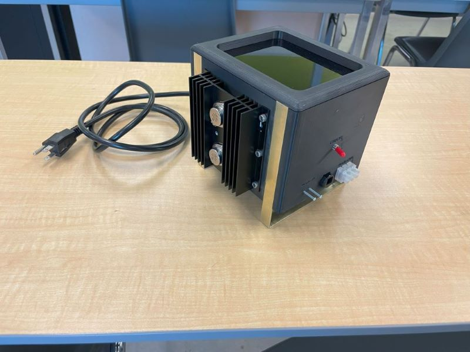

<html lang="en">
<head>
    <meta charset="UTF-8">
    <meta name="viewport" content="width=device-width, initial-scale=1.0">
    <title>Jesse Russell - Engineering Portfolio</title>
    <link rel="stylesheet" href="style.css">
</head>
<body>
    <header>
        

            <h1>Jesse Russell - Engineering Portfolio</h1>
            <nav>
                <ul>
                    <li><a href="#experience">Experience</a></li>
                    <li><a href="#education">Education</a></li>
                    <li><a href="#skills">Skills</a></li>
                    <li><a href="#projects">Projects</a></li>
                    <li><a href="#gallery">Gallery</a></li>
                    <li><a href="#contact">Contact</a></li>
                </ul>
            </nav>
        

    </header>

    <section id="experience">
        

            <h2>Experience</h2>
            

                <h3>Engineering Intern</h3>
                
<strong>Norbec Architectural</strong>, 2024 - Present

                <ul>
                    <li>Commissioned chemical unloading, storage, and delivery systems for new facility construction.</li>
                    <li>Collaborated with skilled trades to streamline facility launch and production processes.</li>
                    <li>Led trials and testing for IMP manufacturing lines.</li>
                    <li>Implemented Computerized Maintenance Management Systems (CMMS) and Preventive Maintenance (PM) software.</li>
                    <li>Used JIRA to assist in project management tasks of several sub-projects.</li>
                    <li>Assisted in Process Safety and Hazard Review (PSHR) and lockout procedures for interlocked systems.</li>
                    <li>Completed DSD documents and IS wiring analysis; supported multiple Electrical Safety Authority (ESA) inspections in hazardous locations.</li>
                </ul>
            

            

                <h3>Formula SAE Electric Team Manager</h3>
                
<strong>Conestoga College</strong>, 2022 - Present

                <ul>
                    <li>Managed a team to build a gas-powered buggy conforming to SAE rules; led endurance testing.</li>
                    <li>Spearheaded the design and development of an electric SAE race car, moving it from concept to fabrication.</li>
                    <li>Mentored team members in design processes and collaboration strategies.</li>
                </ul>
            

            

                <h3>Engineering Support Coordinator</h3>
                
<strong>Arvin-Sango Canada</strong>, 2022 - 2024

                <ul>
                    <li>Installed and maintained inventory management systems for tooling and parts during new line implementation.</li>
                    <li>Rewired and reprogrammed Fanuc robots and updated PLC/HMI systems to accommodate new tasks while maintaining safety standards.</li>
                    <li>Supported maintenance teams with diagnostics, troubleshooting, and repairs for various machines.</li>
                    <li>Contributed to facility expansion plans, ensuring efficient project execution.</li>
                </ul>
            

            

                <h3>Damage Prevention Technician</h3>
                
<strong>G-Tel Engineering</strong>, 2018 - 2022

                <ul>
                    <li>Led teams to produce as-built drawings for underground assets during capital projects.</li>
                    <li>Performed root cause analysis and implemented preventative measures to ensure quality assurance (QA).</li>
                    <li>Developed software to streamline data conversion and improve workflow efficiency.</li>
                    <li>Collaborated with contractors to explore new contract strategies and improve service delivery.</li>
                </ul>
            

            

                <h3>Instructor/Apprentice</h3>
                
<strong>Honda Canada</strong>, 2015 - 2018

                <ul>
                    <li>Trained individuals of various ages in equipment usage and safe practices.</li>
                    <li>Represented Honda at tradeshows, handling setup, teardown, and equipment demonstrations.</li>
                </ul>
            

        

    </section>

    <section id="education">
        

            <h2>Education</h2>
            

                <h3>Bachelor of Engineering, Electronic Systems Engineering</h3>
                
<strong>Conestoga College</strong>, 2022 - 2024

                <ul>
                    <li>3rd Year engineering student graduating summer 2026</li>
                    <li>Focused on circuit design, microcontroller programming, and communication systems with real-world application in projects.</li>
                    <li>Completed several projects involving embedded systems and neighboring fields.</li>
                </ul>
            

            

                <h3>Bachelor of Science, Computer Science</h3>
                
<strong>Western University</strong>, 2017 - 2019

                <ul>
                    <li>Programming (Python, Java, C++)</li>
                    <li>Software engineering (SDLC, integration, testing)</li>
                    <li>Introduction to German</li>
                </ul>
            

        

    </section>

    <section id="skills">
        

            <h2>Skills</h2>
            <ul>
                <li>Programming: C/C++, Java, Python</li>
                <li>Software Development: OOP, PDLC, Algorithm Development</li>
                <li>3D Modeling: SolidWorks</li>
                <li>PCB Design: Altium</li>
                <li>Automation & Control: PLC/HMI Programming</li>
                <li>Tools: MS Office (Word, Excel, PowerPoint, Access, Project), Basic Machining (Mill/Lathe)</li>
            </ul>
        

    </section>

    <section id="projects">
        

            <h2>Projects</h2>
            

                
                

                    <h3>Classic Car Restoration</h3>
                    
Passion for rebuilding and restoring classic automobiles. Engine tuning, bodywork, and mechanical restoration using advanced techniques and tools.

                

            

            

                
                

                    <h3>Custom Multimeter</h3>
                    
Designed and developed a custom multimeter for electronics testing. Features precise measurement capabilities and ease of use for various testing conditions.

                

            

            

                
                

                    <h3>Omni Directional Rover</h3>
                    
Designed and developed a custom power and control board. Programmed R-Pi and Arm Cortex M4 microcontroller to control a 5-DOF arm on an omnidirectional base. Computed inverse kinematics and displayed real-time simulation via ROS.

                

            

            

                
                

                    <h3>Class AB Audio Amplifier</h3>
                    
Built and fine-tuned a high-quality Class AB audio amplifier for personal use, balancing sound clarity and power efficiency with precision circuitry.

                

            

        

    </section>

    <section id="gallery">
        

            <h2>Gallery</h2>
            

                
                

                    <h3>Gallery Item 1</h3>
                    
Short description of the work or project shown in the image.

                

            

            

                
                

                    <h3>Gallery Item 2</h3>
                    
Short description of the work or project shown in the image.

                

            

            <!-- Add more gallery items as needed -->
        

    </section>

    <section id="contact">
        

            <h2>Contact</h2>
            
If you'd like to get in touch, feel free to email me at <a href="mailto:JessRuss256@gmail.com">JessRuss256@gmail.com</a>.

        

    </section>

    <footer>
        

            
&copy; 2024 Jesse Russell. All rights reserved.

        

    </footer>

    
</body>
</html>
